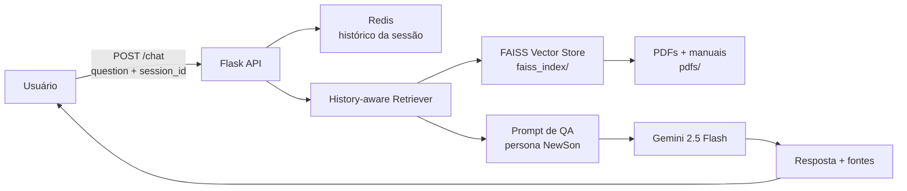

# FestoAssist – Assistente Conversacional IA (NewSon)


## Visão Geral

**FestoAssist** (assistente *NewSon*) é uma API de **Retrieval-Augmented Generation (RAG)** que responde perguntas técnicas sobre equipamentos pneumáticos Festo com base em documentação oficial (datasheets e manuais em PDF). Faz parte do ecossistema [festo-digital-twin](https://github.com/Macorfilho/festo-digital-twin), atuando como a camada de inteligência conversacional do gêmeo digital.

O problema que resolve: engenheiros e técnicos de manutenção precisam consultar rapidamente manuais extensos e dispersos. Em vez de procurar manualmente em PDFs, o usuário pergunta em linguagem natural e recebe uma resposta contextualizada com a fonte técnica de origem.

**Casos de uso:**
- Consultas sobre atuadores (DSNU, DSBC), válvulas 5/2 vias (V1, V2) e sensores de fim de curso (1S1, 1S2, 2S1, 2S2)
- Troubleshooting operacional e recomendações de manutenção da Estação de Manipulação Pneumática Festo
- Suporte técnico 24/7 via chat REST com histórico de conversa por sessão

## Tecnologias Utilizadas

| Categoria | Tecnologia | Uso no projeto |
|---|---|---|
| Linguagem | Python 3.10+ | Linguagem principal da API |
| Framework | Flask + flask-cors | API REST e configuração de CORS |
| IA Conversacional | Google Gemini (`gemini-2.5-flash`) | Geração de respostas (LLM) |
| Embeddings | Google Gemini (`models/embedding-001`) | Geração de embeddings para busca vetorial |
| Orquestração RAG | LangChain (langchain-core, langchain-community, langchain-google-genai) | Cadeia RAG conversacional com histórico |
| Vector Store | FAISS (faiss-cpu) | Índice vetorial da base de conhecimento |
| Histórico de Chat | Redis (langchain-redis) | Persistência de histórico de conversa por `session_id` |
| Processamento de Docs | PyMuPDF + UnstructuredMarkdownLoader | Extração de texto de PDFs e Markdown |
| Servidor de Produção | Gunicorn | Servidor WSGI (`app:create_app()`) |
| Containerização | Docker (multi-stage, python:3.12-slim) | Build de imagem otimizada para produção |
| Configuração | python-dotenv | Carregamento de variáveis de ambiente |

## Arquitetura & Funcionalidades

### Funcionalidades implementadas

- **Chat com contexto RAG**: endpoint `POST /chat` recebe `question` e `session_id`, recupera documentos técnicos relevantes do índice FAISS e gera resposta com o modelo Gemini citando as fontes.
- **Histórico de conversa**: o `session_id` habilita histórico persistente em Redis, permitindo perguntas de acompanhamento sem perder o contexto.
- **Persona especializada**: o prompt de sistema define o "NewSon" como especialista na Estação de Manipulação Pneumática Festo (atuadores DSNU/DSBC, válvulas V1/V2, sensores 1S1/1S2/2S1/2S2), com regras de precisão e citação de fontes.
- **Ingestão de documentos**: `build_vectorstore.py` carrega PDFs e Markdown do diretório `pdfs/`, divide em chunks (1000 caracteres com 100 de overlap) e constrói o índice FAISS local.
- **Health check**: endpoint `GET /health` verifica se o agente foi inicializado corretamente.
- **Injeção de dependências**: a cadeia RAG é montada via `AgentService` recebendo LLM, retriever e provedor de histórico como dependências.

### Fluxo da cadeia RAG



### Estrutura do projeto

```
FestoAssist/
├── app.py                  # Aplicação Flask e rotas (/chat, /health)
├── agent_manager.py        # PromptFactory + AgentService (cadeia RAG)
├── providers.py            # Provedores de modelo, vector store e histórico
├── config.py               # Leitura de GOOGLE_API_KEY e REDIS_URL
├── build_vectorstore.py    # Script de ingestão e construção do índice FAISS
├── wsgi.py                 # Entry point WSGI para Gunicorn
├── API.md                  # Documentação detalhada da API
├── Dockerfile              # Imagem multi-stage para produção
├── requirements.txt        # Dependências Python
├── .env.example            # Exemplo de variáveis de ambiente
├── pdfs/                   # Documentação técnica (PDFs/Markdown) para ingestão
└── faiss_index/            # Índice vetorial FAISS construído
```

> **Documentação da API**: a referência completa de endpoints, payloads e respostas está em [API.md](API.md).

## Instalação e Configuração

### Pré-requisitos

- Python 3.10+
- Git
- Redis rodando localmente (ou uma URL de Redis acessível)
- Chave de API do Google Gemini (`GOOGLE_API_KEY`)

### Passo a passo

```bash
git clone https://github.com/Macorfilho/FestoAssist.git
cd FestoAssist

# Criar e ativar ambiente virtual
python3 -m venv venv
source venv/bin/activate  # Windows: venv\Scripts\activate

# Instalar dependências
pip install -r requirements.txt

# Configurar variáveis de ambiente
cp .env.example .env
```

### Variáveis de ambiente

| Variável | Descrição | Padrão |
|---|---|---|
| `GOOGLE_API_KEY` | Chave de API do Google Gemini (obrigatória) | — |
| `REDIS_URL` | URL de conexão com o Redis usado para histórico de chat | `redis://localhost:6379` |
| `PORT` | Porta do servidor Flask | `8000` |

### Subir o Redis (com Docker)

```bash
docker run -d -p 6379:6379 --name redis-festo redis
```

### Construir o índice vetorial (primeira execução)

Coloque os documentos técnicos (PDF ou Markdown) no diretório `pdfs/` e execute:

```bash
python build_vectorstore.py
```

O script baixa os dados necessários do NLTK, carrega os documentos, gera chunks e salva o índice FAISS em `faiss_index/`.

## Como Executar / Exemplos de Uso

### Modo desenvolvimento

```bash
python app.py
```

Servidor disponível em `http://localhost:8000`.

### Modo produção (Gunicorn)

```bash
gunicorn --bind 0.0.0.0:8000 "app:create_app()"
```

### Com Docker

```bash
docker build -t festoassist:latest .
docker run -d -p 8000:8000 --env-file .env festoassist:latest
```

### Exemplos de uso

**Chat:**

```bash
curl -X POST http://localhost:8000/chat \
  -H "Content-Type: application/json" \
  -d '{
    "question": "Qual o diâmetro do pistão do atuador DSNU?",
    "session_id": "user123_session456"
  }'
```

Resposta:

```json
{
  "answer": "O diâmetro do pistão do atuador DSNU pode variar. Segundo a documentação, existem modelos com diâmetros de 8, 10, 12, 16, 20 e 25 mm."
}
```

**Health check:**

```bash
curl http://localhost:8000/health
```

```json
{
  "status": "ok",
  "message": "FestoTech Assistant está operacional."
}
```

### Dockerfile multi-stage (produção)

O `Dockerfile` usa dois estágios: um *builder* (instala dependências em um venv e baixa os dados NLTK) e um estágio final (imagem mínima `python:3.12-slim-bookworm`, usuário não-root `appuser`, índice FAISS copiado do diretório local). O comando de execução é `gunicorn --bind 0.0.0.0:8000 app:create_app()`.

## Contato / Créditos

**FestoAssist** foi desenvolvido pelo grupo **NewByte** para a parceria **FIAP × Festo**, como módulo de inteligência conversacional do projeto [Festo Digital Twin](https://github.com/Macorfilho/festo-digital-twin) (2º lugar no Desafio Festo 2025).

Desenvolvido por Marcelo R. Corner Filho.

- Portfólio: https://marcelocorner.dev
- GitHub: https://github.com/Macorfilho
- LinkedIn: https://www.linkedin.com/in/marcelocorner